# DuckDuckGo-DeepDark

Light will blind thee in thy search for answers, dark will make them shine. May the dark be kinder on thine eyes. (DuckDuckGo dark theme)

This is a dark theme for DuckDuckGo inspired by [FT DeepDark](https://addons.mozilla.org/en-US/firefox/addon/ft-deepdark/?src=search).

This dark theme is based on the default dark theme for DuckDuckGo found [here](https://userstyles.org/styles/122820/duckduckgo-default-dark-theme).

Also, credit where credit is due for the color palettes down bellow. ([@KDE](https://github.com/KDE), [@horst3180](https://github.com/horst3180), [@linuxmint](https://github.com/linuxmint), [Firefox](https://www.mozilla.org/en-US/firefox/new/), [YouTube](https://www.youtube.com/) and [Discord](https://discordapp.com/))

Theme as a userstyle [here](https://userstyles.org/users/377182).

### **You can also install all my themes at once from [here](https://gitlab.com/RaitaroH/Import-All-Deepdark).**

# Screenshots

Main page
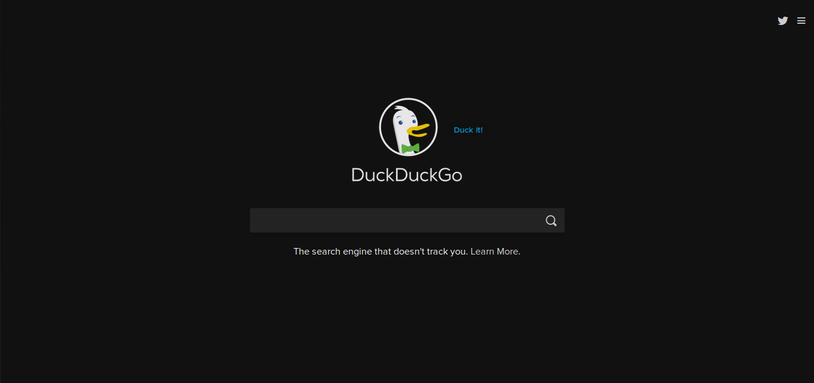

Search

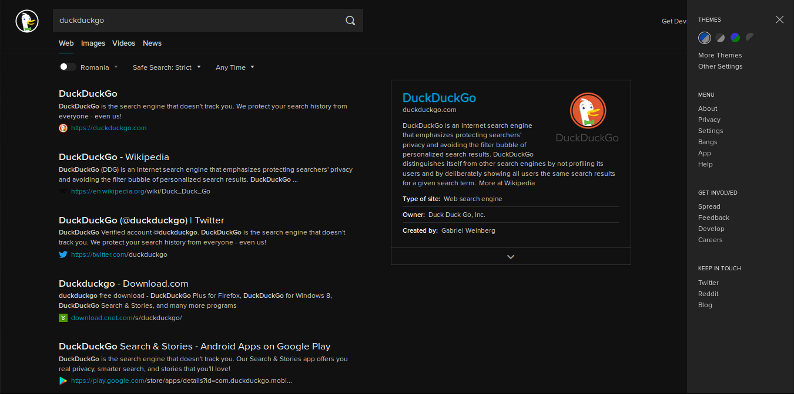

Timer

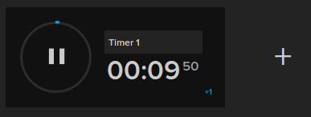

Weather

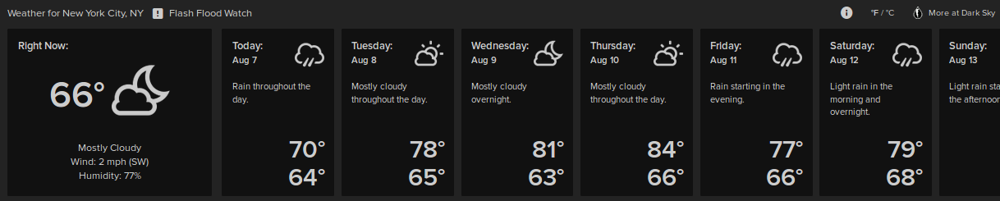

# Colors
Colors Showcase (the colors are available in the code; different colors can be used)
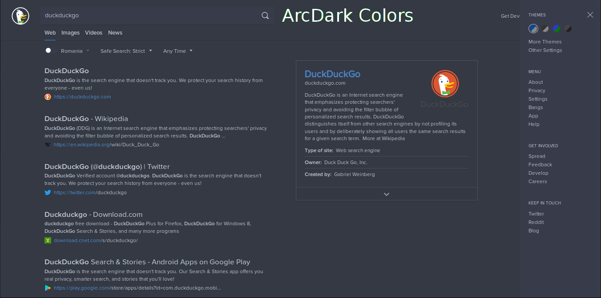
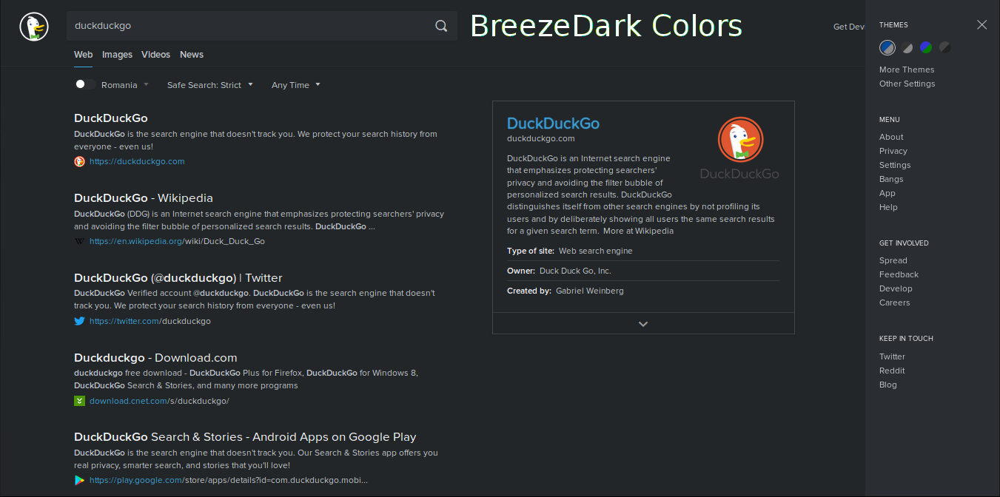
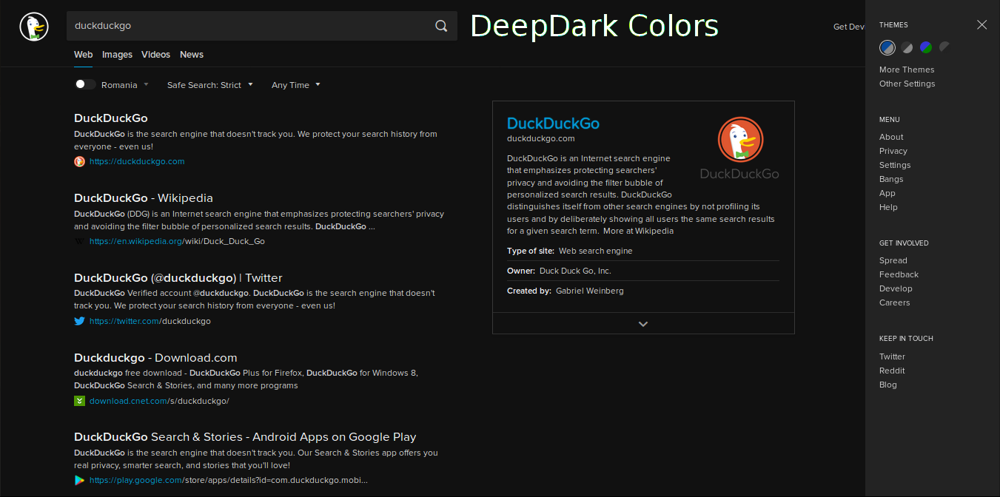
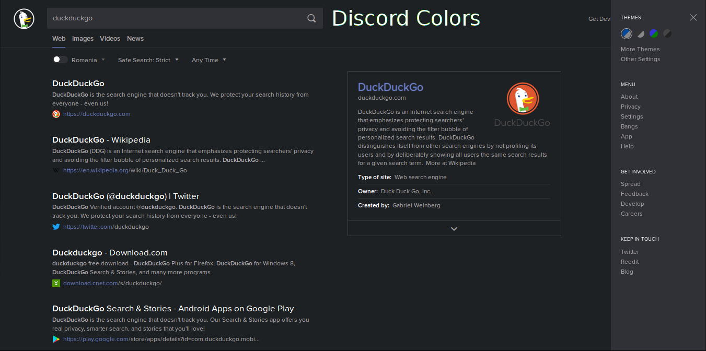
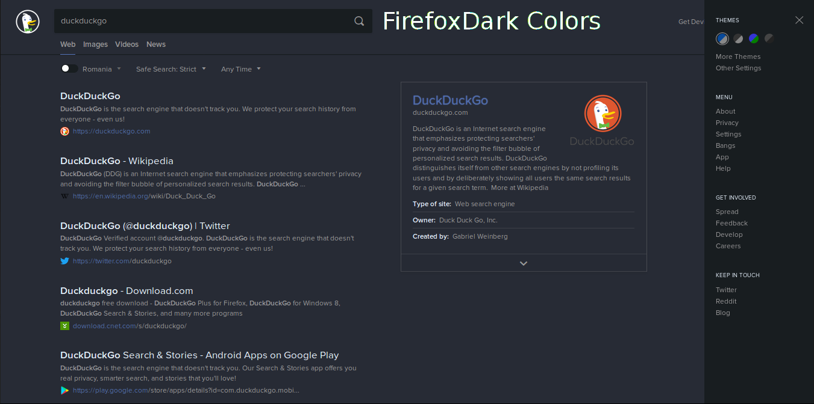
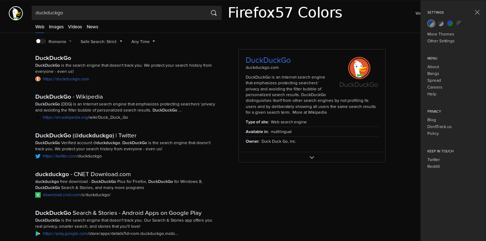
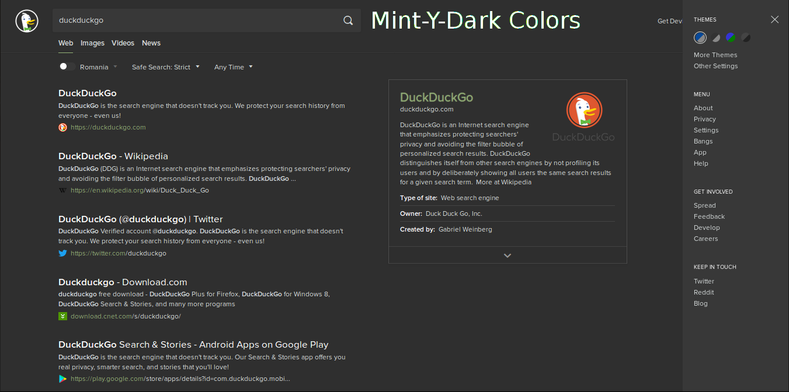
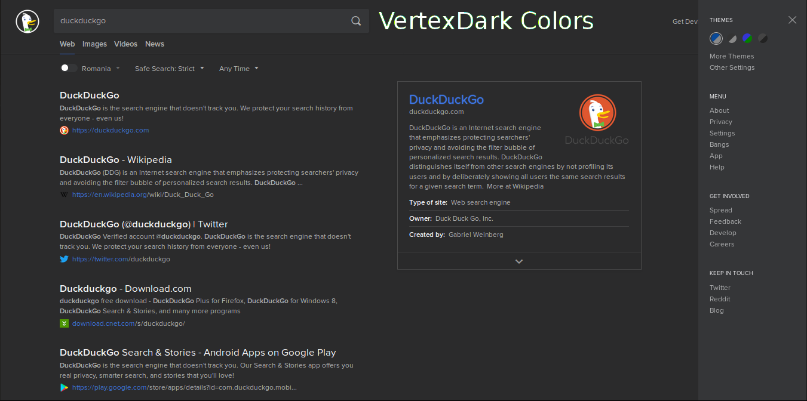
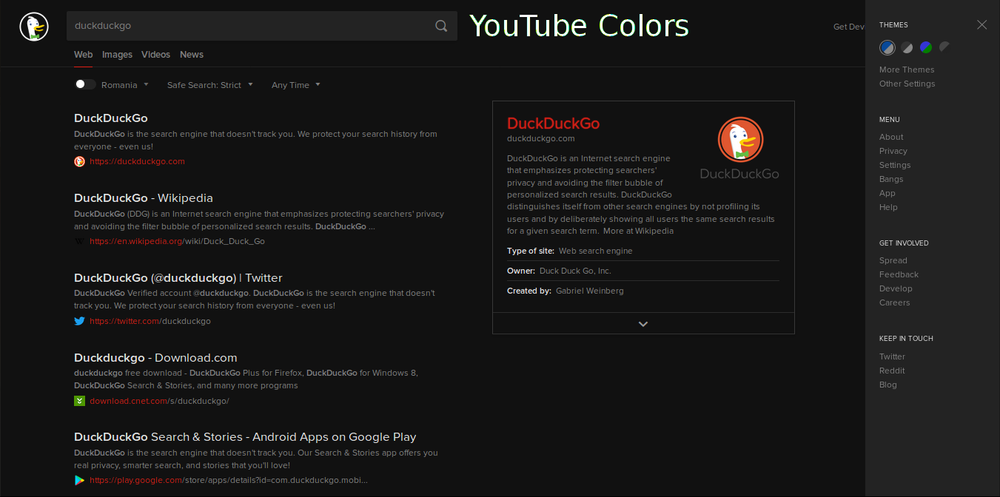
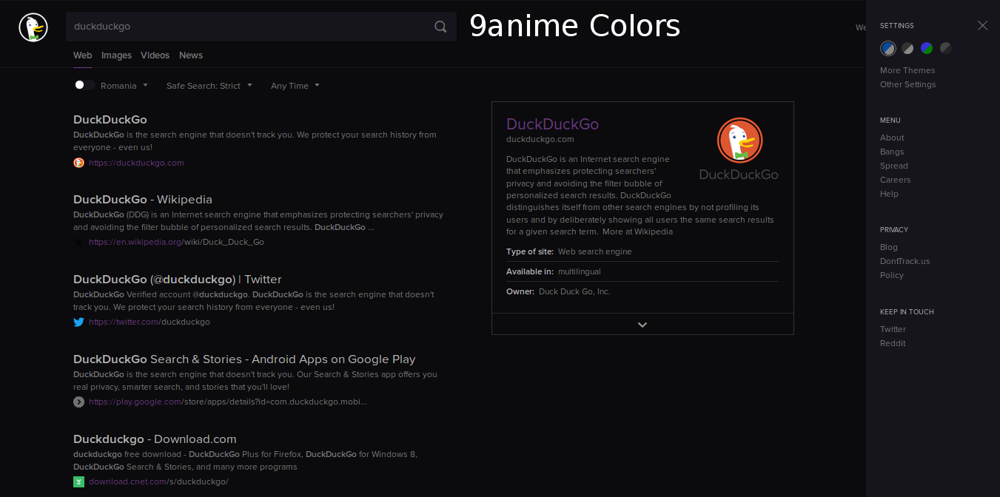
